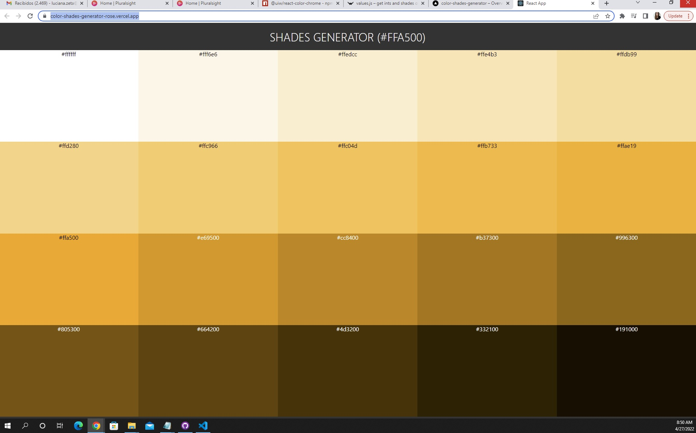
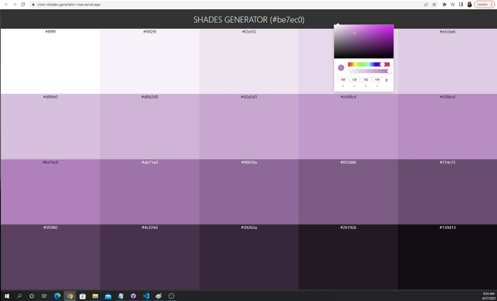

# Color Shades Generator

Aplicación creada con React, Hooks, CSS

  

  

# deploy: 

https://color-shades-generator-rose.vercel.app/

## librerias utilizadas:

1. ### `values.js`
2. ### `React Color Chrome`
3. ### `react-copy-to-clipboard`

In the project directory, you can run:

### `npm start`

Runs the app in the development mode.\
Open [http://localhost:3000](http://localhost:3000) to view it in your browser.
